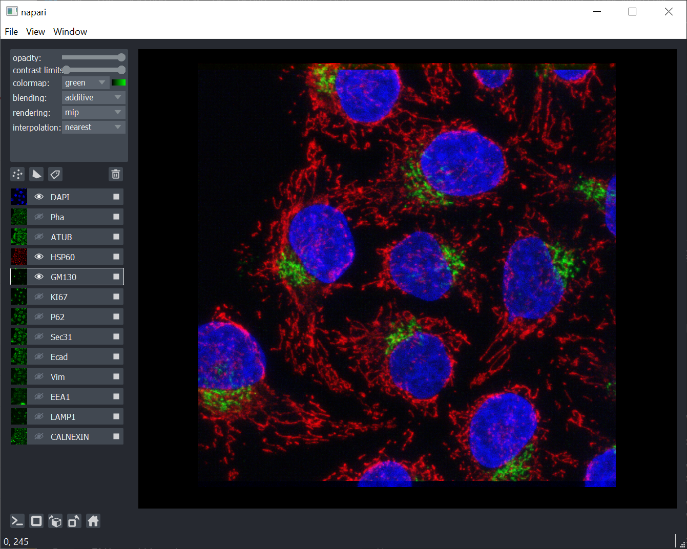
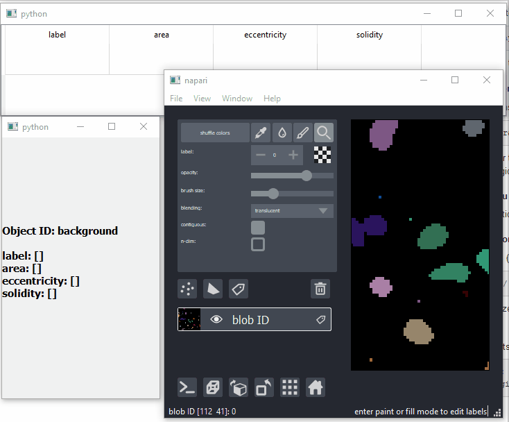
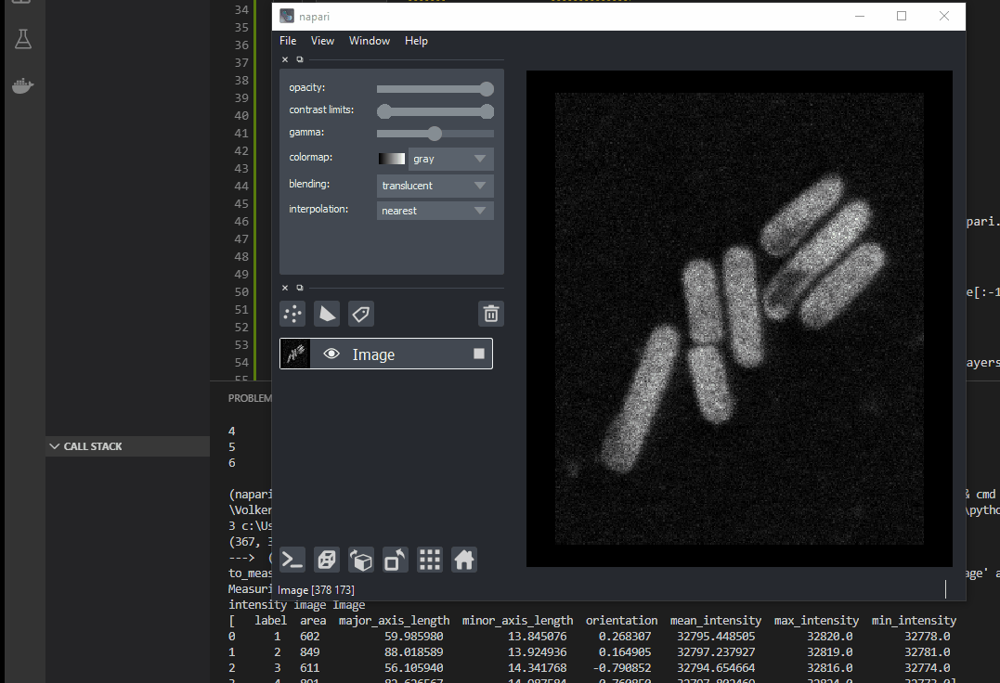

# Napari Playground

Some of my experiments with [Napari](https://github.com/napari/napari). Still baby steps at this point.

## Multilabelling HDF5 viewer

A few years ago, I implemented a hdf5-based format and custom viewer for highly multiplexed 
fluorescence data, [see this Github repo](https://github.com/VolkerH/Multilabelling_HDF5_View).

I managed to implement most of the functionality (including registered display of layers) 
available in my custom viewer with a few lines of python using napari [Source Code](./Multilabelling/multilabel.py).

## Simple label/object inspector demo

A quick and dirty hack, just to show what a label inspector could look like in napari. [Source Code](./CustomMouseFunctions/custom_mouse_functions.py)

An addition to this hack, where measurement is performed by selecting Label and Intensity layers in napari and pressing a key [Source](.CustomMouseFunctions/MeasurementExplorer/region_measurement.py).

## Live webcam with face detection results as shapes layer

Based on the opencv facedetect demo code. Adapted to napari.
Note: requires PyQt5, will crash with PySide (due to opencv using PyQt)
[Code](./LiveUpdate/webcam_opencv.py)
